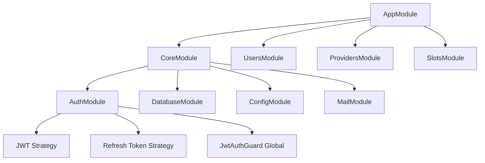

# 🔐 Análise de Segurança — Bonus Hunt API

> **Documento de análise minuciosa** para preparação de deploy em produção.  
> Gerado em: 19 de Janeiro de 2026

---

## 📋 Sumário

1. [Visão Geral da Aplicação](#visão-geral-da-aplicação)
2. [Padrões de Projeto](#padrões-de-projeto)
3. [Camadas de Segurança Existentes](#camadas-de-segurança-existentes)
4. [Pontos Críticos Identificados](#pontos-críticos-identificados)
5. [Pontos de Melhoria](#pontos-de-melhoria)
6. [Recomendações para Produção](#recomendações-para-produção)
7. [Checklist de Segurança para Deploy](#checklist-de-segurança-para-deploy)

---

## Visão Geral da Aplicação

| Aspecto | Descrição |
|---------|-----------|
| **Framework** | NestJS 11.x |
| **ORM** | Prisma 7.x |
| **Banco de Dados** | PostgreSQL |
| **Autenticação** | JWT com Access/Refresh Tokens |
| **Hash de Senhas** | bcrypt (fator 12) |
| **Validação** | class-validator + ValidationPipe global |
| **Documentação** | Swagger/OpenAPI |

### Módulos Funcionais



---

## Padrões de Projeto

> [!IMPORTANT]
> **Meta: Manter estrutura de projeto de nível empresarial** seguindo padrões de empresas como Meta, Google e Amazon.

### Princípios de Código

| Princípio | Descrição |
|-----------|-----------|
| **Self-Documenting Code** | O código deve ser autoexplicativo — **sem comentários**. Nomes de variáveis, funções e classes devem ser suficientemente descritivos. |
| **Single Responsibility** | Cada módulo, classe e função deve ter uma única responsabilidade. |
| **Dependency Injection** | Todas as dependências injetadas via construtor para facilitar testes. |
| **Repository Pattern** | Separação clara entre lógica de negócio (Service) e acesso a dados (Repository). |
| **DTO Pattern** | Validação de entrada com DTOs tipados e decorators de validação. |

### Estrutura Modular Empresarial

```
src/
├── core/                   # Módulos de infraestrutura
│   ├── auth/               # Autenticação e autorização
│   │   ├── decorators/     # @Public, @User, @Roles
│   │   ├── dto/            # DTOs de autenticação
│   │   ├── guards/         # JwtAuthGuard, RolesGuard
│   │   ├── strategies/     # JWT, Refresh Token
│   │   └── auth.service.ts
│   ├── config/             # Configuração de ambiente
│   ├── database/           # Prisma Service
│   └── uploads/            # Configuração Multer
├── modules/                # Módulos de domínio
│   ├── users/
│   ├── providers/
│   └── slots/
├── mail/                   # Serviço de e-mail
├── app.module.ts
└── main.ts
```

### Convenções de Nomenclatura

| Tipo | Convenção | Exemplo |
|------|-----------|---------|
| Classes | PascalCase | `UsersService`, `JwtAuthGuard` |
| Métodos | camelCase | `findByEmail()`, `updateRefreshToken()` |
| Variáveis | camelCase | `passwordHash`, `accessToken` |
| Constantes | UPPER_SNAKE | `IS_PUBLIC_KEY`, `ROLES_KEY` |
| Arquivos | kebab-case | `jwt-auth.guard.ts`, `update-password.dto.ts` |
| Tabelas DB | snake_case | `users`, `hunt_slots`, `user_favorite_slots` |

### Práticas Obrigatórias

- ❌ **Não usar comentários** — código deve ser autoexplicativo
- ✅ **Nomes descritivos** — `buildSafeUser()` não precisa de comentário
- ✅ **Funções pequenas** — máximo 20-30 linhas
- ✅ **Tipagem forte** — usar interfaces e types do TypeScript
- ✅ **Tratamento de erros** — usar exceções do NestJS (`NotFoundException`, `ConflictException`)
- ✅ **Testes** — cobertura de testes unitários e e2e

---

## Camadas de Segurança Existentes

### ✅ Pontos Positivos

#### 1. Autenticação JWT Robusta

- Access Token com expiração curta (15m por padrão)
- Refresh Token com expiração longa (7d por padrão)
- Refresh Token armazenado como **hash bcrypt** no banco

#### 2. Hash de Senhas Seguro

Fator de custo 12 — adequado para produção.

#### 3. ValidationPipe Global

```typescript
app.useGlobalPipes(
  new ValidationPipe({
    whitelist: true,
    forbidNonWhitelisted: true,
  }),
);
```

#### 4. JwtAuthGuard Global

- Rotas privadas por padrão
- Decorator `@Public()` para rotas públicas explícitas

#### 5. CORS Configurado

Origem controlada via `FRONTEND_URL`.

#### 6. Validação de Variáveis de Ambiente

Schema Joi para variáveis obrigatórias.

#### 7. Reset de Senha Seguro

- Token UUID único com expiração (10 minutos)
- Resposta genérica que não revela existência de email

#### 8. Upload de Arquivos Seguro

- Validação de extensão (.jpg, .jpeg, .png)
- Limite de 3MB

#### 9. Não Exposição de Dados Sensíveis

Método `buildSafeUser()` filtra password hash e tokens.

#### 10. GitIgnore Adequado

`.env` e variantes no `.gitignore`.

---

## Pontos Críticos Identificados

### ⚠️ CRÍTICO: Falta de Controle de Acesso Baseado em Roles (RBAC)

> [!CAUTION]
> **Qualquer usuário autenticado pode criar, editar e deletar Slots e Providers!**

Os controllers de `slots` e `providers` não possuem verificação de roles.

**Impacto:** Qualquer usuário pode manipular dados administrativos.

---

### ⚠️ CRÍTICO: Ausência de Rate Limiting

> [!CAUTION]
> A aplicação está vulnerável a ataques de força bruta e DDoS.

Não há proteção contra:
- Ataques de força bruta no login
- Spam de requisições de reset de senha
- Abuso de endpoints de criação

---

### ⚠️ ALTO: Falta de Validação de UUID nos Parâmetros de Rota

Parâmetros de rota não são validados como UUID.

**Risco:** Queries desnecessárias e potencial injection.

---

### ⚠️ ALTO: Access e Refresh Token Usam Mesmo Secret

**Recomendação:** Usar secrets separados para Access e Refresh tokens.

---

### ⚠️ MÉDIO: Swagger Acessível em Produção

**Risco:** Exposição de detalhes da API para atacantes.

---

### ⚠️ MÉDIO: Falta de Helmet para Headers de Segurança

Ausência de headers como X-Content-Type-Options, X-Frame-Options, CSP.

---

### ⚠️ BAIXO: UpdatePasswordDto com Campos Opcionais

Campos `currentPassword` e `newPassword` deveriam ser obrigatórios.

---

## Pontos de Melhoria

### 📊 Matriz de Prioridades

| Prioridade | Item | Esforço | Impacto |
|------------|------|---------|---------|
| 🔴 Crítico | Implementar RBAC | Alto | Alto |
| 🔴 Crítico | Rate Limiting | Médio | Alto |
| 🟠 Alto | Validação UUID em rotas | Baixo | Médio |
| 🟠 Alto | Separar JWT Secrets | Baixo | Médio |
| 🟡 Médio | Helmet middleware | Baixo | Médio |
| 🟡 Médio | Swagger condicional | Baixo | Médio |
| 🟡 Médio | Logging estruturado | Médio | Médio |
| 🟢 Baixo | Corrigir DTOs | Baixo | Baixo |

---

## Recomendações para Produção

### 1. Implementar RBAC

```typescript
enum UserRole {
  USER
  ADMIN
}

model User {
  role UserRole @default(USER)
}
```

```typescript
@Injectable()
export class RolesGuard implements CanActivate {
  constructor(private reflector: Reflector) {}

  canActivate(context: ExecutionContext): boolean {
    const requiredRoles = this.reflector.getAllAndOverride<UserRole[]>(
      ROLES_KEY,
      [context.getHandler(), context.getClass()],
    );
    if (!requiredRoles) return true;
    
    const { user } = context.switchToHttp().getRequest();
    return requiredRoles.includes(user.role);
  }
}
```

---

### 2. Rate Limiting

```bash
npm install @nestjs/throttler
```

```typescript
@Module({
  imports: [
    ThrottlerModule.forRoot([{
      ttl: 60000,
      limit: 100,
    }]),
  ],
  providers: [
    { provide: APP_GUARD, useClass: ThrottlerGuard },
  ],
})
```

---

### 3. Validar UUIDs em Parâmetros

```typescript
@Patch(':id')
async updateSlot(
  @Param('id', ParseUUIDPipe) id: string,
  @Body() updateSlotDto: UpdateSlotDto,
) { }
```

---

### 4. Separar JWT Secrets

```env
JWT_ACCESS_SECRET=access_secret_here
JWT_REFRESH_SECRET=refresh_secret_here
```

---

### 5. Adicionar Helmet

```bash
npm install helmet
```

```typescript
import helmet from 'helmet';
app.use(helmet());
```

---

### 6. Swagger Condicional

```typescript
if (process.env.NODE_ENV !== 'production') {
  const document = SwaggerModule.createDocument(app, config);
  SwaggerModule.setup('api/docs', app, document);
}
```

---

## Checklist de Segurança para Deploy

### Variáveis de Ambiente

- [ ] `JWT_SECRET` com pelo menos 256 bits de entropia
- [ ] `DATABASE_URL` com SSL habilitado (`?sslmode=require`)
- [ ] `NODE_ENV=production`
- [ ] Todas as variáveis obrigatórias configuradas

### Configurações de Servidor

- [ ] HTTPS obrigatório (TLS 1.2+)
- [ ] Headers de segurança via Helmet
- [ ] CORS configurado apenas para domínios permitidos
- [ ] Rate limiting configurado
- [ ] Swagger desabilitado ou protegido

### Banco de Dados

- [ ] Conexão SSL obrigatória
- [ ] Usuário com permissões mínimas
- [ ] Backup automatizado

### Autenticação

- [ ] RBAC implementado para rotas administrativas
- [ ] Rate limiting em endpoints de autenticação
- [ ] Tokens JWT com secrets separados

### Qualidade de Código

- [ ] Código autoexplicativo sem comentários
- [ ] Seguindo padrões empresariais (Meta/Google/Amazon)
- [ ] Testes unitários com boa cobertura
- [ ] Logging estruturado sem dados sensíveis

---

## Resumo Final

| Categoria | Status |
|-----------|--------|
| **Autenticação** | ✅ Bom |
| **Validação de Entrada** | ✅ Bom |
| **Autorização** | ❌ Crítico — Falta RBAC |
| **Rate Limiting** | ❌ Ausente |
| **Headers de Segurança** | ⚠️ Ausente |
| **Padrões de Código** | ✅ Bom |
| **Upload de Arquivos** | ✅ Bom |

> [!IMPORTANT]
> **Antes de produção, implementar:**
> 1. Sistema de Roles (RBAC)
> 2. Rate Limiting
> 3. Helmet
> 4. Swagger condicional

---

*Documento de análise de segurança pré-produção.*
